# Disentanglement in beta-VAE

A Keras implementation of the following paper:
 
[Understanding disentangling in β-VAE, Burgess et al., arxiv:1804.03599, 2018](https://arxiv.org/abs/1804.03599)

## Dependencies
 ```
python        3.6.5
keras         2.1.6
tensorboard   1.7.0
PIL           5.0.0
imageio       2.3.0
```
## Data set
1) Celeb-A (training : 157882, validation: 36568, classes: 8519)
2) 3D chairs (training: 64650, validation: 15516, classes: 1293)

## Pre-processing steps:
As a part of the pre-processing, the input data
was normalized by dividing the pixels by 255 and then subtracting from 0.5 so that the pixel distribution resembles a
near-Gaussian distribution with a central mode.

## Training:
As implemented in the paper, the gamma was chosen as 1000. The capacity parameter, C, was linearly increased from 0 to
50 over a course of 150 epochs and then kept constant till the end of training (200 epochs). The bottlenecks for Celeb-A and 
the 3D-Chairs experiment were taken as 32 and 16 respectively. As in the paper, the optimizer and the base learning rate 
were selected to be ADAM and 5e-4 respectively. The [VAE model](src/architectures/deepmind_enc_model.pdf) was implemented as in the paper. 
 
## To Use:
### For training
To run the training script change the parameters in the bash script according to user specification and then 
run the bash script using the command:
```
sh run_training.sh 
```
The training_script.py can directly run from the src directory as:

1) For the Celeb-A data set:
```
python training_script.py --data_dir path/to/Celeb_A_data_dir --bottleneck 32 --val_split 0.2 \
--train_batch_size 64 --val_batch_size 64 --optimizer ADAM --base_learning_rate 5e-4 --num_epochs 200 \
--scheduler_epoch 5 --decay_factor 0.1 --vae_gamma 1000 --capacity 50 --max_epochs 150 --num_workers 8 --multi_process True
```
2) For 3D-chairs data set:

```
python training_script.py --data_dir path/to/3D_Chairs_data_dir --bottleneck 16 --val_split 0.2 \
--train_batch_size 64 --val_batch_size 64 --optimizer ADAM --base_learning_rate 5e-4 --num_epochs 200 \
--scheduler_epoch 5 --decay_factor 0.1 --vae_gamma 1000 --capacity 50 --max_epochs 150 --num_workers 8 --multi_process True
```
### For visualizing 
Firstly mention the path to the saved model in config.py. To visualize the translations over the latent space 
mention the path to the test image in the bash script and then run using the command:

```
sh run_visualize.sh
```
The visualize_script.py can directly be run as :

```
python visualize_script.py --test_image path/to/test_image --start_range -3 --end_range 3 --traversal_steps 100 \
--image_size 64
```

## Results:

1) Celeb-A :

Input image : 


Traversals (left to right):

| | | | | | | | |
|:-------------------------:|:-------------------------:|:-------------------------:|:-------------------------:|:-------------------------:|:-------------------------:|:-------------------------:|:-------------------------:|
|||||||||
|||||||||
|||||||||
|||||||||

Input image : 


Traversals (left to right):

| | | | | | | | |
|:-------------------------:|:-------------------------:|:-------------------------:|:-------------------------:|:-------------------------:|:-------------------------:|:-------------------------:|:-------------------------:|
|||||||||
|||||||||
|||||||||
|||||||||

Input image : 


Traversals (left to right):

| | | | | | | | |
|:-------------------------:|:-------------------------:|:-------------------------:|:-------------------------:|:-------------------------:|:-------------------------:|:-------------------------:|:-------------------------:|
|||||||||
|||||||||
|||||||||
|||||||||

Input image: 


Traversals (left to right):

| | | | | | | | |
|:-------------------------:|:-------------------------:|:-------------------------:|:-------------------------:|:-------------------------:|:-------------------------:|:-------------------------:|:-------------------------:|
|||||||||
|||||||||
|||||||||
|||||||||

2) 3D-Chairs :

Input image : 


Traversals (left to right):

| | | | | | | | |
|:-------------------------:|:-------------------------:|:-------------------------:|:-------------------------:|:-------------------------:|:-------------------------:|:-------------------------:|:-------------------------:|
|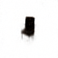|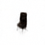|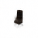|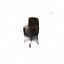|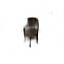|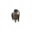|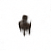|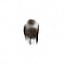|
|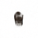|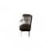||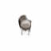|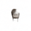|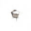|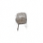|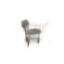|

Input image : 


Traversals (left to right): 

| | | | | | | | |
|:-------------------------:|:-------------------------:|:-------------------------:|:-------------------------:|:-------------------------:|:-------------------------:|:-------------------------:|:-------------------------:|
|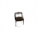|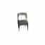|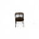|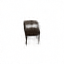|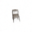|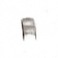|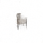|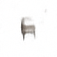|
|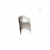|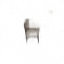|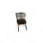|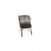|||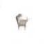||

Input image (left to right): 


Traversals: 

| | | | | | | | |
|:-------------------------:|:-------------------------:|:-------------------------:|:-------------------------:|:-------------------------:|:-------------------------:|:-------------------------:|:-------------------------:|
|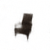|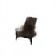|||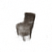|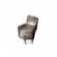|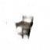|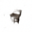|
|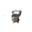|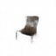|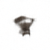|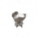|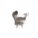|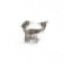|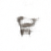|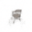|

Input image : 


Traversals (left to right): 

| | | | | | | | |
|:-------------------------:|:-------------------------:|:-------------------------:|:-------------------------:|:-------------------------:|:-------------------------:|:-------------------------:|:-------------------------:|
|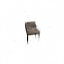|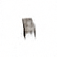|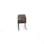|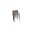|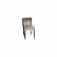|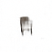|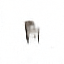|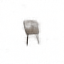|
|||||||||

## Reference:
1)[Understanding disentangling in β-VAE, Burgess et al., arxiv:1804.03599, 2018](https://arxiv.org/abs/1804.03599)

2)[beta-VAE: Learning Basic Visual Concepts with a Constrained Variational Framework ](https://openreview.net/forum?id=Sy2fzU9gl)

3)[Github repo](https://github.com/1Konny/Beta-VAE): A pytorch implementation by [WonKwang Lee](https://github.com/1Konny)
